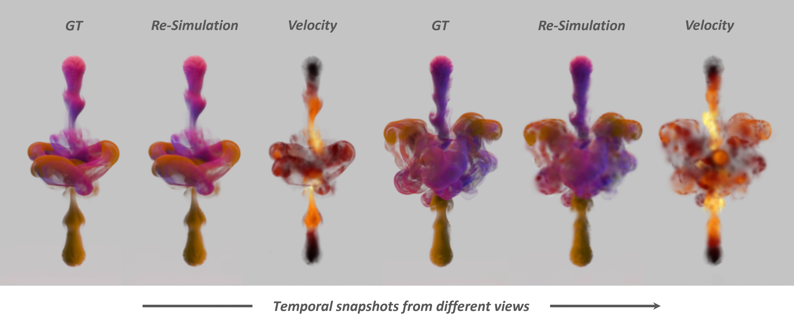

# LagrangianSplats

Official code release for **LagrangianSplats: Divergence-Free Transport of Gaussian Primitives for Fluid Reconstruction**.



## Supported Scenes

To Reconstruct a specific scene and run the evaluation, simply run:

```bash
python main.py --configs configs/scenes/<scene>.py
```

Available scenes:

```text
scalarsyn
scalarreal
suzanne
sphere
biplume
```


## Installation

The released code has been tested with Python 3.7, PyTorch 1.13.1, and CUDA
11.7 on an NVIDIA RTX 4090. Create the environment and build the CUDA
extensions with:

```bash
git submodule update --init --recursive
conda env create -f environment.yml
conda activate lagrangian-splats
bash scripts/install.sh
```

Make sure the CUDA toolkit visible through `nvcc` matches the CUDA version used
by PyTorch. The CUDA extensions will fail to build if, for example, PyTorch is
compiled with CUDA 11.7 but `nvcc` is CUDA 12.4.

Check the versions before building:

```bash
python -c "import torch; print(torch.__version__, torch.version.cuda)"
nvcc --version
```

The CUDA extensions are built from:

```text
submodules/depth-diff-gaussian-rasterization
submodules/simple-knn
```

After installation, verify that the compiled extensions can be imported:

```bash
python -c "import diff_gaussian_rasterization; import simple_knn._C; print('CUDA extensions OK')"
```

## Data

The scene data and GT volumes are not stored in this Git repository. They are
hosted on Hugging Face:

```text
https://huggingface.co/datasets/tnx123/LagrangianSplats-Dataset
```

To download one scene:

```bash
export LAGRANGIAN_SPLATS_DATA_URL=https://huggingface.co/datasets/tnx123/LagrangianSplats-Dataset/resolve/main
bash scripts/download_data.sh scalarsyn
```

Replace `scalarsyn` with any supported scene name, or use `all` to download every
scene. The full release is large, so downloading a single scene first is
recommended unless you need to reproduce all experiments.

The downloader expects the dataset repository to provide:

```text
data/<scene>.tar.gz
gt/<scene>.tar.gz
SHA256SUMS
```

After extraction, the repository should contain:

```text
data/smoke/scalarsyn
data/smoke/scalarreal
data/smoke/suzanne
data/smoke/sphere
data/smoke/biplume

gt/scalarsyn
gt/suzanne
gt/sphere
gt/biplume
```

`scalarreal` does not ship with default GT volumes since this is a real-captured
dataset. The `gt/` archives are only required for evaluation against reference
density/velocity fields; training can still be run from the scene data alone.
